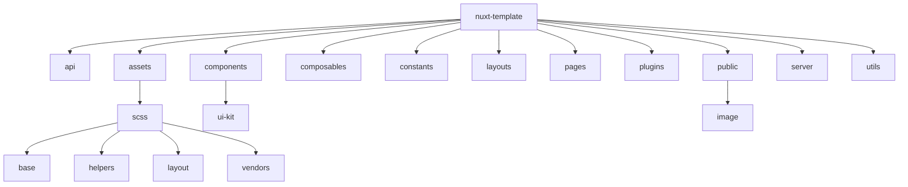

# Оглавление

0. [Минимальные требования перед запуском проекта](#Минимальные-требования-перед-запуском-проекта)
1. [Используемый стек](#Используемый-стек)
2. [Code style](#Code-style)
3. [Как включить авто форматирование кода в различных IDE](#Как-включить-авто-форматирование-кода-в-различных-IDE)
4. [Структура проекта](#Структура-проекта)
5. [Работа с API](#Работа-с-API)
6. [Работа с формами](#Работа-с-формами)
7. [Комментирование кода](#Комментирование-кода)
7. [Команды](#Команды)

# Минимальные требования перед запуском проекта

Ознакомиться с [используемым стеком](#Используемый-стек), хотя бы частично.

Установить минимальную версию `Node.js`: v18.20.4 (LTS)

Установить минимальную версию `npm`: v10.7.0 (Latest)

# Используемый стек

- Фреймворк - [nuxt 3 @^3.12.4](https://nuxt.com/docs/getting-started/introduction) 
- Язык - [typescript @^5.5.3](https://www.typescriptlang.org/docs/)
- Глобальное хранилище - [@pinia/nuxt @^0.5.1](https://nuxt.com/modules/pinia)
- Ui библиотека - [shadcn-nuxt @^0.10.4](https://www.shadcn-vue.com/docs/installation/nuxt.html)
- Линтеры - [@nuxt/eslint @^0.3.13](https://eslint.nuxt.com/), [husky @^9.1.4](https://github.com/typicode/husky), [lint-staged @^15.2.7](https://github.com/lint-staged/lint-staged)
- Препроцессор - [SASS @^1.77.8](https://sass-lang.com/)
- Валидация - [@vee-validate/nuxt @^4.13.2](https://vee-validate.logaretm.com/v4/integrations/nuxt/), [@vee-validate/yup @^4.13.2](https://vee-validate.logaretm.com/v4/guide/composition-api/typed-schema#yup)

# Code style


Несмотря на то, что на проекте используется автоматическое форматирование кода (как его включить [читать тут](#Как-включить-авто-форматирование-кода-в-различных-IDE)), 
есть вещи которые нужно контролировать самому **(иначе получите втык от ревьюера)** 

## Нэйминг

- Формат имен файлов - **PascalCase** 
- Формат названий констант - **SCREAM_CASE**
- Формат названий функций и переменных - **camelCase**
- Формат названий CSS селекторов - [БЭМ](https://ru.bem.info/methodology/css/)
- Формат использования тегов (компонентов) - **PascalCase**

# Как включить авто форматирование кода в различных IDE

## VS Code

1. Скачать плагин [ESLint](https://marketplace.visualstudio.com/items?itemName=dbaeumer.vscode-eslint)
2. В настройках пользователя `VS Code` (`settings.json`) добавить следующие параметры:
```json
{
  "eslint.format.enable": true,
  "editor.codeActionsOnSave": {
    "source.fixAll.eslint": "explicit"
  },
  "eslint.run": "onSave"
}
```
3. Перезапустить `IDE`

## Webstorm

1. Зайти в настройки `Settings`
2. Вбить в поиске `ESLint`
3. Внутри `ESLint` выбрать пункт `Automatic ESLint configuration` и поставить галочку в графе `Run eslint --fix on save`
4. Перезапустить `IDE`

Теперь при сохранении файла будет выполняться авто форматирование кода.

# Структура проекта

В этом разделе будет подробно (по возможности) описана структура проекта, чтобы не возникало вопросов, что, где и почему

Общая структура проекта будет выглядеть следующим образом:



Дальше разберем каждую по отдельности

## 📁 /api

В данной директории будут находиться функции-запросы, разделенные по модулям, т.е. модуль авторизации (auth.js), 
модуль работы с пользователем (user.js) и т.д.

Это поможет нам скомпоновать идентичные запросы в одном месте и избавит нас от дублирования одинаковых запросов.

❗Исключением является запрос, который существует конкретно на одной странице и в одном месте, тогда
создание модуля избыточно.

## 📁 /assets

В данной директории будут находиться стили, которые доступны всему проекту

### 📁 /scss

Все файлы с расширением `.scss` начинаются с префикса `_`, за исключением `main.scss` - он является основным.

Директория разделена на 4 подпапки:

- base - базовые стили, которые применяются ко всем элементам на сайте
- helpers - вспомогательные стили, которые облегчают разработку, такие как миксины, переменные и т.д.
- layout - стили для разметки сайта
- vendors - стили для внешних библиотек или фреймворков

```
scss/
|
|- base/
|  |- _normalize.scss      // Стандартные стили
|  |- _typography.scss     // Типография: h1-h4, p и т.д.
|
|- helpers/
|  |- _mixins.scss                  // Миксины SCSS
|  |- _variables-tailwind.scss      // Переменные цветов, размеров и т.д (для тайлвинда).
|  |- _variables.scss               // Переменные цветов, размеров и т.д.
|
|- layout/ (по необходимости)
|  |- _header.scss         // Header
|  |- _footer.scss         // Footer
|  |- _sidebar.scss        // Sidebar
|
|- vendors/ (по необходимости)
|  |- _notifications.scss  // Notifications
|
- main.scss                // Главный SCSS файл
```

## 📁 /components

В данной директории будут находиться все компоненты вашего приложения.

### 📁 /ui-kit

Тут будут лежать все компоненты ui-kit-а (в нашем случае `shadcn-nuxt`), а также все "глупые" компоненты 
(т.е. сами они ничего не могут, в основном служат для отображения входных данных).

## 📁 /composables

В данной директории будут находиться все функциональные компоненты. Каждый файл обязательно должен называться с приставки `use-`.

## 📁 /constants

В данной директории будут находиться все статичные переменные, используемые в проекте, включая endpoints.

## 📁 /layouts

В данной директории будут находиться все слои вашего приложения, например header, footer и т.д.

## 📁 /pages

В данной директории будут находиться все ваши страницы.

## 📁 /plugins

В данной директории будут находиться все ваши сторонние (или кастомные) плагины.

## 📁 /public

В данной директории будут находиться фав-иконки и различные изображения.

### 📁 /image

Тут будут лежать изображения в формате .png, .webp и т.д.

## 📁 /utils

В данной директории будут находиться все служебных функции, например:

- error-notification.js - функция для отображения ошибок

# Работа с API
Для отправки серверных запросов используем кастомный `useCustomFetch`, основанный на `useFetch`, 
для отправки клиентских запросов используем `$api`, основанный на `$fetch`, в чем разница серверных/клиентских запросов
можно ознакомить на странице официальной документации [Nuxt](https://nuxt.com/docs/getting-started/data-fetching).

Если вкратце, то клиентские запросы - это обычные, всем нам известные запросы, которые мы использовали во `Vue 3`, 
`Vue 2`, `React` и т.д., они выполняются на стороне клиента, либо при монтировании страницы, либо при взаимодействии 
с пользователем. Серверные же запросы, исходя из названия выполняются еще на стороне сервера, еще до монтирования страницы, 
но во время гидрации (или регидрации - это одно и тоже), сделано это для того, 
чтобы у пользователя не было ситуации, где данных еще нет, ему в любом случае уже придет готовый `html`

## Пример серверного запроса
```vue
<script setup>
import { balanceApi } from '~/api';

const { data } = await balanceApi.getTransactions();
const transactions = transactionsData.value;
</script>
```
где функция `getTransactions` выглядит следующим образом:
```js
import { Endpoints } from '~/constants';

export const getTransactions = async () =>
{
	return await useCustomFetch(Endpoints.TRANSACTIONS);
};
```

## Пример клиентского запроса
```js
async function editUser(user)
{
	this.loading = true;
	try
	{
		await userApi.editUser(user);
		const { toast } = useToast();
		this.user = Object.assign(this.user, user);
		toast({ title: 'Данные личного кабинета успешно обновлены' });
	}
	catch (e)
	{
		useToast(e.msg, 'destructive');
	}
	finally
	{
		this.loading = false;
	}
}
```
где функция `editUser` выполняется клиентом при submit или на change, т.е. инициируется клиентом, сама функция `editUser` выглядит следующим образом:
```js
import { Endpoints } from '~/constants';

export const getUser = async () =>
{
	return await useCustomFetch(Endpoints.USER);
};

export const editUser = async (user) =>
{
	const { $api } = useNuxtApp();

	return await $api(Endpoints.USER, { method: 'PATCH', body: user });
};
```

Все функции-запросы описываются в папке 📁 `API`, где каждый файл назван своей сущностью, условно файл `user.js` отвечает за 
запросы связанные с юзером, `auth.js` с авторизацией и т.д., все файлы скрепляются файлом `index.js`, для того, чтобы 
облегчить путь к файлу и дать нэйминг каждой сущности, выглядит он следующим образом:
```js
export * as authApi from './auth';
export * as userApi from './user';
...
```
Благодаря этому импорт будет выглядеть так:
```js 
import { userApi } from '~/api';
```
вместо
```js
import { editUser, getUser } from '~/api/user';
```

# Комментирование кода
В каких случаях требуется комментирование кода:

- Объяснение цели или назначения определенного блока кода, если она не очевидна.
- Описание сложных алгоритмов или логики, которые могут быть сложно понятны для других разработчиков.
- Указание на предполагаемые ошибки или проблемы, которые могут возникнуть в коде.
- Описание намерений или целей разработчика при написании определенного фрагмента кода, если она не очевидна.
- Комментирование важных или критических частей кода для обеспечения понимания других разработчиков.

И все следующий файлы, даже если их назначение очевидно из названия файла/функции:

- Все файлы/функции внутри папки 📁 `composables`
- Все файлы/функции внутри папки 📁 `helpers`
- Все файлы/функции внутри папки 📁 `plugins`
- Все файлы/функции внутри папки 📁 `utils`

Пример, когда не стоит писать комментарий ❌:
```js
// Это объект, который представляет пользователя
const user = {
  name: "John Doe",
  age: 30,
  email: "john.doe@example.com"
};
```
```js
// Функция для суммирования чисел
const add = (a, b) => a + b;
```
Но если мы создали `utils`, который помогает нам с суммированием, то описываем его следующим образом:
```js
/**
 * Функция для суммирования двух чисел.
 * @param a - Первое число для суммирования.
 * @param b - Второе число для суммирования.
 * @return {number} Сумма двух чисел.
 */
const add = (a, b) => {
	return a + b;
}
```

# Работа с формами
Для работы с формами мы будем использовать shad-cn компоненты. Для валидации используется `@vee-validate/nuxt` 
в скупе с `@vee-validate/yup`, более детально можно ознакомиться на странице официальной документации [Vee validate](https://vee-validate.logaretm.com/v4/guide/composition-api/typed-schema#yup).

## Пример использования формы:
```vue
<script setup>
import { useForm } from 'vee-validate';
import { number, object, string } from 'yup';
import { toTypedSchema } from '@vee-validate/yup';
import { PHONE_MASK } from '~/constants';

const userStore = useUserStore();
const user = userStore.user;

const { handleSubmit } = useForm({
	validationSchema: toTypedSchema(
		object({
			firstName: string()
				.min(2, 'Имя должно содержать не менее 2 символов')
				.max(16, 'Имя должно содержать не более 16 символов')
				.default(user.firstName),
			lastName:
				string()
					.min(2, 'Фамилия должна содержать не менее 2 символов')
					.max(16, 'Фамилия должна содержать не более 16 символов')
					.default(user.lastName),
			phone: string()
				.length(18, 'Номер телефона введен некорректно')
				.default(user.phone),
			company: string()
				.default(user.company),
			position: string()
				.default(user.position),
			email: string()
				.required('Почта должна быть заполнена')
				.email('Почта введена некорректно')
				.default(user.email),
		}),
	),
});

const onSubmit = handleSubmit(async (submitted) =>
{
	await userStore.editUser(submitted);
});
</script>

<template>
	<form @submit="onSubmit">
		<UiCard class="w-full max-w-4xl">
			<UiCardHeader class="flex-row justify-between">
				<div class="flex flex-col">
					<UiCardTitle class="text-2xl">
						Редактирование данных
					</UiCardTitle>
					<UiCardDescription>Здесь можно редактировать свои данные</UiCardDescription>
				</div>
				<UiButton
					variant="outline"
					class="gap-4 h-10 w-10 p-0"
					@click.prevent="$emit('handleToggleEditForm')"
				>
					<IconUndo2 />
				</UiButton>
			</UiCardHeader>
			<UiCardContent class="grid gap-4 md:gap-8 lg:grid-cols-2 xl:grid-cols-2">
				<div class="grid gap-4">
					<UiFormField
						v-slot="{ componentField }"
						name="firstName"
					>
						<UiFormItem>
							<UiFormLabel>Имя</UiFormLabel>
							<UiFormControl>
								<UiInput
									type="text"
									placeholder="Имя"
									v-bind="componentField"
								/>
							</UiFormControl>
							<UiFormMessage />
						</UiFormItem>
					</UiFormField>
					<UiFormField
						v-slot="{ componentField }"
						name="lastName"
					>
						<UiFormItem>
							<UiFormLabel>Фамилия</UiFormLabel>
							<UiFormControl>
								<UiInput
									type="text"
									placeholder="Фамилия"
									v-bind="componentField"
								/>
							</UiFormControl>
							<UiFormMessage />
						</UiFormItem>
					</UiFormField>
					<UiFormField
						v-slot="{ componentField }"
						name="company"
					>
						<UiFormItem>
							<UiFormLabel>Название компании</UiFormLabel>
							<UiFormControl>
								<UiInput
									type="text"
									placeholder="Название компании"
									v-bind="componentField"
								/>
							</UiFormControl>
							<UiFormMessage />
						</UiFormItem>
					</UiFormField>
				</div>
				<div class="grid gap-4">
					<UiFormField
						v-slot="{ componentField }"
						name="phone"
					>
						<UiFormItem>
							<UiFormLabel>Номер телефона</UiFormLabel>
							<UiFormControl>
								<UiInput
									type="text"
									placeholder="Номер телефона"
									v-bind="componentField"
									:mask="PHONE_MASK"
								/>
							</UiFormControl>
							<UiFormMessage />
						</UiFormItem>
					</UiFormField>
					<UiFormField
						v-slot="{ componentField }"
						name="email"
					>
						<UiFormItem>
							<UiFormLabel>E-mail</UiFormLabel>
							<UiFormControl>
								<UiInput
									type="email"
									placeholder="m@example.com"
									v-bind="componentField"
								/>
							</UiFormControl>
							<UiFormMessage />
						</UiFormItem>
					</UiFormField>
					<UiFormField
						v-slot="{ componentField }"
						name="position"
					>
						<UiFormItem>
							<UiFormLabel>Название должности</UiFormLabel>
							<UiFormControl>
								<UiInput
									type="text"
									placeholder="Название должности"
									v-bind="componentField"
								/>
							</UiFormControl>
							<UiFormMessage />
						</UiFormItem>
					</UiFormField>
				</div>
			</UiCardContent>
			<UiCardFooter>
				<UiButton :loading="userStore.loading">
					Сохранить
				</UiButton>
			</UiCardFooter>
		</UiCard>
	</form>
</template>

<style scoped>

</style>
```

# Команды

## Установка

Обязательно установите зависимости:

```bash
npm install
```

## Запуск локальной версии

Запустите сервер разработки на `http://localhost:3000` (если не занят):

```bash
npm run dev
```

## Сборка проекта

Сборка для продакшена:

```bash
npm run build
```

Локальный предварительный просмотр сборки:

```bash
npm run preview
```

Для получения дополнительной информации ознакомьтесь с [документацией по развертыванию](https://nuxt.com/docs/getting-started/deployment).
